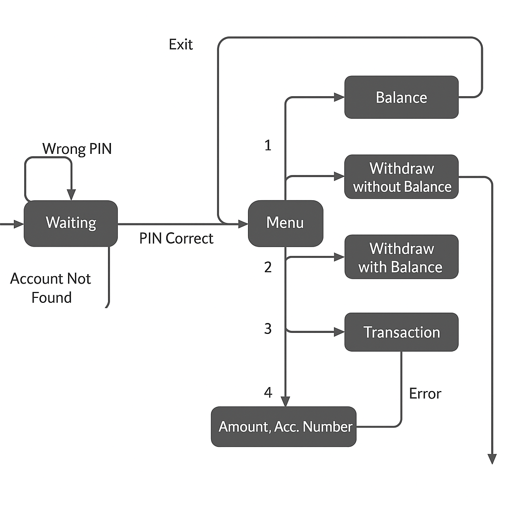
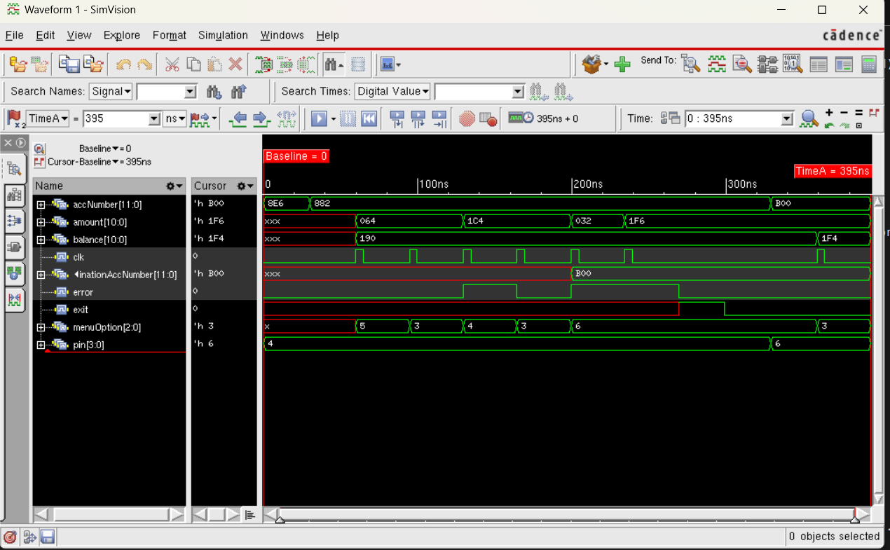

# FSM-based-ATM-design
A Verilog-based FSM (Finite State Machine) design that simulates the core functionality of an ATM system, including PIN verification, transaction processing, and state transitions. Designed for simulation and learning purposes using HDL.

This diagram illustrates the Finite State Machine (FSM) logic of the ATM system, showing the different states like Waiting, Menu, Balance, Withdraw, and Transaction along with the transitions based on user inputs.

The waveform below shows the simulation result of the FSM-based ATM design, verifying correct state transitions and functionality using test inputs.
